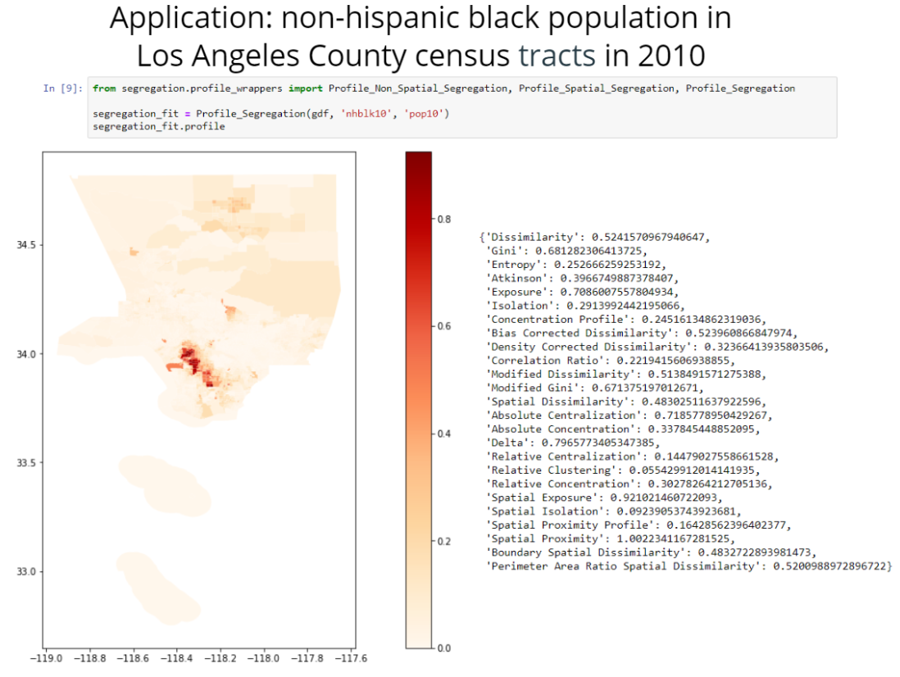
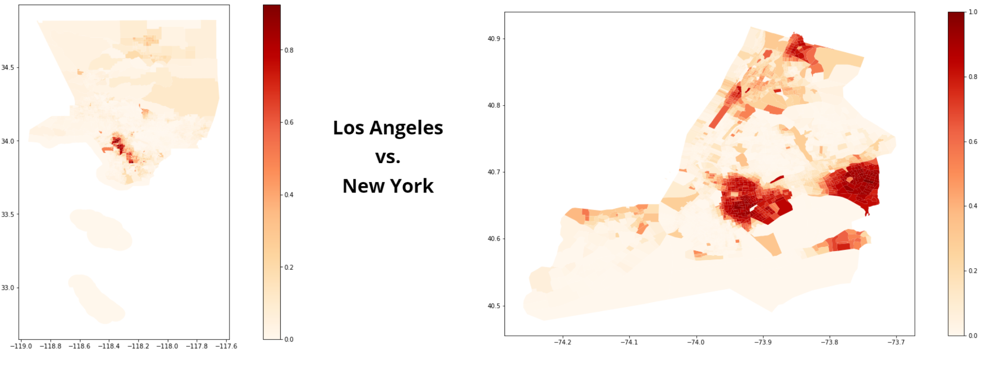
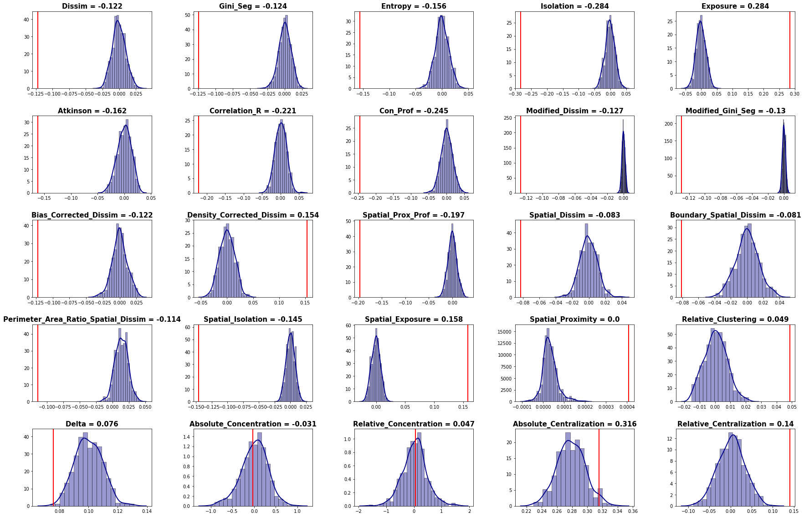

Segregation Measures Framework in PySAL
=======================================

[](https://travis-ci.org/pysal/segregation)

## Analytics for spatial and aspatial segregation in Python.

**Easily estimate several segregation measures:**




**Perform comparative segregation:**






## What is segregation?

The PySAL **segregation** module allows users to estimate several segregation measures, perform inference for single values and for comparison between values and decompose comparative segregation.

It can be divided into frameworks: 

- Point Estimation: point estimation of many aspatial and spatial segregation indexes.
- Inference Wrappers: present functions to perform inference for a single measure or for comparison between two measures.
- Decompose Segregation: decompose comparative segregation into spatial and attribute components.

Installation
------------

i) `pip` directly running in the prompt:

```
pip install segregation
```

ii) Using the `conda-forge` channel as described in https://github.com/conda-forge/segregation-feedstock:

```
conda config --add channels conda-forge
conda install segregation
```

iii) Another recommended method for installing segregation is with [anaconda](https://www.anaconda.com/download/). Clone this repository or download it manually then `cd` into the directory and run the following commands (this will install the development version):

```
$ conda env create -f environment.yml
$ source activate segregation
$ python setup.py develop
```

iv) `pip` directly from this repository running in the prompt (if you experience an issue trying to install this way, take a look at this discussion: https://github.com/pysal/segregation/issues/15):

```
$ pip install git+https://github.com/pysal/segregation
```


#### Segregation uses:

- pandas
- geopandas
- matplotlib
- scikit-learn
- seaborn
- numpy
- scipy
- libpysal

## Getting started

### Single group measures

All input data for this module rely on [pandas](https://github.com/pandas-dev/pandas) DataFrames for the aspatial measures and [geopandas](https://github.com/geopandas/geopandas) DataFrames for spatial ones. In a nutshell, the user needs to pass the pandas DataFrame as its first argument and then two string that represent the variable name of population frequency of the group of interest (variable <tt>group_pop_var</tt>) and the total population of the unit (variable <tt>total_pop_var</tt>).

So, for example, if a user would want to fit a dissimilarity index (D) to a DataFrame called <tt>df</tt> to a specific group with frequency <tt>freq</tt> with each total population <tt>population</tt>, a usual call would be something like this:

```python
from segregation.aspatial import Dissim
index = Dissim(df, "freq", "population")
```

If a user would want to fit a spatial dissimilarity index (SD) to a geopandas DataFrame called <tt>gdf</tt> to a specific group with frequency <tt>freq</tt> with each total population <tt>population</tt>, a usual call would be something like this:

```python
from segregation.spatial import SpatialDissim
spatial_index = SpatialDissim(gdf, "freq", "population")
```

Every class of **segregation** has a <tt>statistic</tt> and a <tt>core\_data</tt> attributes. The first is a direct access to the point estimation of the specific segregation measure and the second attribute gives access to the main data that the module uses internally to perform the estimates. To see the estimated D in the first generic example above, the user would have just to run <tt>index.statistic</tt> to see the fitted value.

For point estimation, all the measures available can be summarized in the following table:


| **Measure**                                       | **Class/Function**                      | **Spatial?** | **Specific Arguments** |
| :------------------------------------------------ | :-------------------------------------- | :----------: | :-----------------: |
| Dissimilarity (D)                                 | Dissim                                  |      No      |         \-          |
| Gini (G)                                          | GiniSeg                                 |      No      |         \-          |
| Entropy (H)                                       | Entropy                                 |      No      |         \-          |
| Isolation (xPx)                                   | Isolation                               |      No      |         \-          |
| Exposure (xPy)                                    | Exposure                                |      No      |         \-          |
| Atkinson (A)                                      | Atkinson                                |      No      |          b          |
| Correlation Ratio (V)                             | CorrelationR                            |      No      |         \-          |
| Concentration Profile (R)                         | ConProf                                 |      No      |          m          |
| Modified Dissimilarity (Dct)                      | ModifiedDissim                          |      No      |     iterations      |
| Modified Gini (Gct)                               | ModifiedGiniSeg                         |      No      |     iterations      |
| Bias-Corrected Dissimilarity (Dbc)                | BiasCorrectedDissim                     |      No      |          B          |
| Density-Corrected Dissimilarity (Ddc)             | DensityCorrectedDissim                  |      No      |        xtol         |
| Spatial Proximity Profile (SPP)                   | SpatialProxProf                         |     Yes      |          m          |
| Spatial Dissimilarity (SD)                        | SpatialDissim                           |     Yes      |   w, standardize    |
| Boundary Spatial Dissimilarity (BSD)              | BoundarySpatialDissim                   |     Yes      |     standardize     |
| Perimeter Area Ratio Spatial Dissimilarity (PARD) | PerimeterAreaRatioSpatialDissim         |     Yes      |     standardize     |
| Distance Decay Isolation (DDxPx)                  | DistanceDecayIsolation                  |     Yes      |     alpha, beta     |
| Distance Decay Exposure (DDxPy)                   | DistanceDecayExposure                   |     Yes      |     alpha, beta     |
| Spatial Proximity (SP)                            | SpatialProximity                        |     Yes      |     alpha, beta     |
| Absolute Clustering (ACL)                         | AbsoluteClustering                      |     Yes      |     alpha, beta     |
| Relative Clustering (RCL)                         | RelativeClustering                      |     Yes      |     alpha, beta     |
| Delta (DEL)                                       | Delta                                   |     Yes      |         \-          |
| Absolute Concentration (ACO)                      | AbsoluteConcentration                   |     Yes      |         \-          |
| Relative Concentration (RCO)                      | RelativeConcentration                   |     Yes      |         \-          |
| Absolute Centralization (ACE)                     | AbsoluteCentralization                  |     Yes      |         \-          |
| Relative Centralization (RCE)                     | RelativeCentralization                  |     Yes      |         \-          |


Once the segregation indexes are fitted, the user can perform inference to shed light for statistical significance in regional analysis. The summary of the inference framework is presented in the table below:


| **Inference Type** | **Class/Function**   |                 **Function main Inputs**                 |         **Function Outputs**         |
| :----------------- | :------------------- | :------------------------------------------------------: | :----------------------------------: |
| Single Value       | InferSegregation   |   seg\_class, iterations\_under\_null, null\_approach, two\_tailed    |    p\_value, est\_sim, statistic     |
| Two Values         | CompareSegregation | seg\_class\_1, seg\_class\_2, iterations\_under\_null, null\_approach | p\_value, est\_sim, est\_point\_diff |


Another useful analytics that can be performed with the **segregation** module is a decompositional approach where two different indexes can be brake down into spatial components (<tt>c_s</tt>) and attribute component (<tt>c_a</tt>). This framework is summarized in the table below:


| **Framework** | **Class/Function**   |                 **Function main Inputs**                 |         **Function Outputs**         |
| :----------------- | :------------------- | :------------------------------------------------------: | :----------------------------------: |
| Decomposition       | DecomposeSegregation   |   index1, index2, counterfactual\_approach    |    c\_a, c\_s     |


### Multigroup measures

It also possible to estimate Multigroup measures. This framework also relies on [pandas](https://github.com/pandas-dev/pandas) DataFrames for the aspatial measures.

Suppose you have a DataFrame called <tt>df</tt> that has populations of some groups, for example, <tt>Group A</tt>, <tt>Group B</tt> and <tt>Group C</tt>. A usual call for a multigroup Dissimilarity index would be:

```python
from segregation.aspatial import MultiDissim
index = MultiDissim(df, ['Group A', 'Group B', 'Group C'])
```

Therefore, a <tt>statistic</tt> attribute will contain the value of this index.


Currently, theses indexes are summarized in the table below:

| **Measure**                                       | **Class/Function**                        | **Spatial?** | **Specific Arguments** |
| :------------------------------------------------ | :---------------------------------------- | :----------: | :-----------------: |
| Multigroup Dissimilarity                          | MultiDissim                               |      No      |         \-          |
| Multigroup Gini                                   | MultiGiniSeg                              |      No      |         \-          |
| Multigroup Normalized Exposure                    | MultiNormalizedExposure                   |      No      |         \-          |
| Multigroup Information Theory                     | MultiInformationTheory                    |      No      |         \-          |
| Multigroup Relative Diversity                     | MultiRelativeDiversity                    |      No      |         \-          |
| Multigroup Squared Coefficient of Variation       | MultiSquaredCoefficientVariation          |      No      |         \-          |
| Multigroup Diversity                              | MultiDiversity                            |      No      |     normalized      |
| Simpson's Concentration                           | SimpsonsConcentration                     |      No      |         \-          |
| Simpson's Interaction                             | SimpsonsInteraction                       |      No      |         \-          |
| Multigroup Divergence                             | MultiDivergence                           |      No      |         \-          |

### Local measures

Also, it is possible to calculate local measures of segregation. A <tt>statistics</tt> (the attribute is in the plural since, many statistics are fitted) attribute will contain the values of these indexes. Currently, they are summarized in the table below:

| **Measure**                                       | **Class/Function**                        | **Spatial?** | **Specific Arguments** |
| :------------------------------------------------ | :---------------------------------------- | :----------: | :-----------------: |
| Location Quotient                                 | MultiLocationQuotient                     |      No      |         \-          |
| Local Diversity                                   | MultiLocalDiversity                       |      No      |         \-          |
| Local Entropy                                     | MultiLocalEntropy                         |      No      |         \-          |
| Local Simpson's Concentration                     | MultiLocalSimpsonConcentration            |      No      |         \-          |
| Local Simpson's Interaction                       | MultiLocalSimpsonInteraction              |      No      |         \-          |
| Local Centralization                              | LocalRelativeCentralization               |      Yes     |         \-          |

If you are new to segregation and PySAL you will best get started with our documentation! We encourage you to take a look at some examples of this module in the <tt>notebooks</tt> repo!


Contribute
----------

PySAL-segregation is under active development and contributors are welcome.

If you have any suggestion, feature request, or bug report, please open a new [issue](https://github.com/pysal/inequality/issues) on GitHub. To submit patches, please follow the PySAL development [guidelines](http://pysal.readthedocs.io/en/latest/developers/index.html) and open a [pull request](https://github.com/pysal/segregation). Once your changes get merged, you’ll automatically be added to the [Contributors List](https://github.com/pysal/segregation/graphs/contributors).

Support
-------

If you are having issues, please talk to us in the [gitter room](https://gitter.im/pysal/pysal).

License
-------

The project is licensed under the [BSD license](https://github.com/pysal/pysal/blob/master/LICENSE.txt).

Funding
-------

 Award #1831615 [RIDIR: Scalable Geospatial Analytics for Social Science Research](https://www.nsf.gov/awardsearch/showAward?AWD_ID=1831615)

 Renan Xavier Cortes is grateful for the support of Coordenação de Aperfeiçoamento de Pessoal de Nível Superior - Brazil (CAPES) - Process number 88881.170553/2018-01
