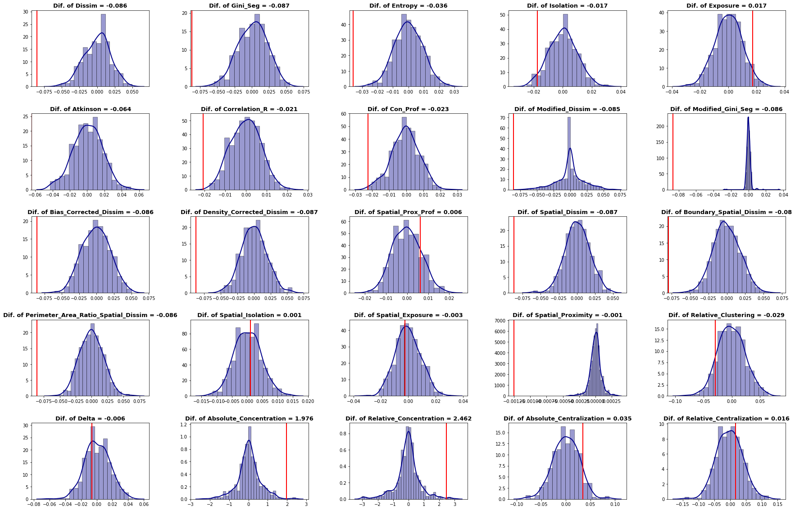

Segregation Measures Framework in PySAL
=======================================

# segregation

[](https://travis-ci.org/pysal/inequality)

**Methods for estimating and performing inference for spatial and non-spatial segregation.**



## What is segregation?

The PySAL **segregation** module allow users to estimate several segregation measures and perform inference for single measures and comparative inference in a concise way. 

It can be divided into two frameworks: point estimation and inference.  The first framework could be, in turn, subdivided in non-spatial indexes and spatial indexes.  The inference approach present functions to perform inference for a single measure or for comparison between two measures.

Installation
------------

The recommended method for installing segregation is with [anaconda](https://www.anaconda.com/download/). To get started with the development version, clone this repository or download it manually then `cd` into the directory and run the following commands:

```
conda env create -f environment.yml
source activate segregation
python setup.py develop
```

#### Segregation uses:

- libpysal
- pandas
- geopandas
- numpy
- scipy
- scikit-learn

## Getting started

All input data for this module rely on [pandas](https://github.com/pandas-dev/pandas) DataFrames for the non-spatial measures and [geopandas](https://github.com/geopandas/geopandas) DataFrames for spatial ones. In a nutshell, the user needs to pass the pandasDataFrame as its first argument and then two string that represent the variable name of population frequency of the group of interest (variable <tt>group_pop_var</tt>) and the total populationof the unit (variable <tt>total_pop_var</tt>).

So, for example, if a user would want to fit a dissimilarity index (D) to a DataFrame called <tt>df</tt> to a specific group with frequency <tt>freq</tt> with each total population <tt>population</tt>, a usual call would be something like this:

```
from segregation.dissimilarity import Dissim
index = Dissim(df, "freq", "population")
```

Every class of **segregation** has a <tt>statistic</tt> and a <tt>core\_data</tt> attributes. The first is a direct access to the point estimation of the specific segregation measure and the second attribute gives access to the main data that the module uses internally to perform the estimates. To see the estimated D in the generic example above, the user would have just to run <tt>index.statistic</tt> to see the fitted value.

For point estimation, all the measures available can be summarized in the following table:


| **Measure**                                       | **Class/Function**                      | **Spatial?** | **Function Inputs** |
| :------------------------------------------------ | :-------------------------------------- | :----------: | :-----------------: |
| Dissimilarity (D)                                 | Dissim                                  |      No      |         \-          |
| Gini (G)                                          | Gini\_Seg                               |      No      |         \-          |
| Entropy (H)                                       | Entropy                                 |      No      |         \-          |
| Isolation (xPx)                                   | Isolation                               |      No      |         \-          |
| Exposure (xPy)                                    | Exposure                                |      No      |         \-          |
| Atkinson (A)                                      | Atkinson                                |      No      |          b          |
| Correlation Ratio (V)                             | Correlation\_R                          |      No      |         \-          |
| Concentration Profile (R)                         | Con\_Prof                               |      No      |          m          |
| Modified Dissimilarity (Dct)                      | Modified\_Dissim                        |      No      |     iterations      |
| Modified Gini (Gct)                               | Modified\_Gini\_Seg                     |      No      |     iterations      |
| Bias-Corrected Dissimilarity (Dbc)                | Bias\_Corrected\_Dissim                 |      No      |          B          |
| Density-Corrected Dissimilarity (Ddc)             | Density\_Corrected\_Dissim              |      No      |         \-          |
| Spatial Proximity Profile (SPP)                   | Spatial\_Prox\_Prof                     |     Yes      |          m          |
| Spatial Dissimilarity (SD)                        | Spatial\_Dissim                         |     Yes      |   w, standardize    |
| Boundary Spatial Dissimilarity (BSD)              | Boundary\_Spatial\_Dissim               |     Yes      |     standardize     |
| Perimeter Area Ratio Spatial Dissimilarity (PARD) | Perimeter\_Area\_Ratio\_Spatial\_Dissim |     Yes      |     standardize     |
| Spatial Isolation (SxPx)                          | Spatial\_Isolation                      |     Yes      |     alpha, beta     |
| Spatial Exposure (SxPy)                           | Spatial\_Exposure                       |     Yes      |     alpha, beta     |
| Spatial Proximity (SP)                            | Spatial\_Proximity                      |     Yes      |     alpha, beta     |
| Relative Clustering (RCL)                         | Relative\_Clustering                    |     Yes      |     alpha, beta     |
| Delta (DEL)                                       | Delta                                   |     Yes      |         \-          |
| Absolute Concentration (ACO)                      | Absolute\_Concentration                 |     Yes      |         \-          |
| Relative Concentration (RCO)                      | Relative\_Concentration                 |     Yes      |         \-          |
| Absolute Centralization (ACE)                     | Absolute\_Centralization                |     Yes      |         \-          |
| Relative Centralization (RCE)                     | Relative\_Centralization                |     Yes      |         \-          |


Once the segregation indexes are fitted, the user can perform inference to shed light for statistical significance in regional analysis. The summary of the inference framework is presented in the table below:


| **Inference Type** | **Class/Function**   |                 **Function main Inputs**                 |         **Function Outputs**         |
| :----------------- | :------------------- | :------------------------------------------------------: | :----------------------------------: |
| Single Value       | Infer\_Segregation   |   seg\_class, iterations\_under\_null, null\_approach, two\_tailed    |    p\_value, est\_sim, statistic     |
| Two Value          | Compare\_Segregation | seg\_class\_1, seg\_class\_2, iterations\_under\_null, null\_approach | p\_value, est\_sim, est\_point\_diff |

  
  
If you are new to segregation and PySAL you will best get started with our documentation!


Contribute
----------

PySAL-segregation is under active development and contributors are welcome.

If you have any suggestion, feature request, or bug report, please open a new [issue](https://github.com/pysal/inequality/issues) on GitHub. To submit patches, please follow the PySAL development [guidelines](http://pysal.readthedocs.io/en/latest/developers/index.html) and open a [pull request](https://github.com/pysal/segregation). Once your changes get merged, you’ll automatically be added to the [Contributors List](https://github.com/pysal/segregation/graphs/contributors).

Support
-------

If you are having issues, please talk to us in the [gitter room](https://gitter.im/pysal/pysal).

License
-------

The project is licensed under the [BSD license](https://github.com/pysal/pysal/blob/master/LICENSE.txt).

Funding
-------

 Award #1831615 [RIDIR: Scalable Geospatial Analytics for Social Science Research](https://www.nsf.gov/awardsearch/showAward?AWD_ID=1831615)

 This study was financed in part by the Coordenação de Aperfeiçoamento de Pessoal de Nível Superior - Brasil (CAPES) - Process number 88881.170553/2018-01
