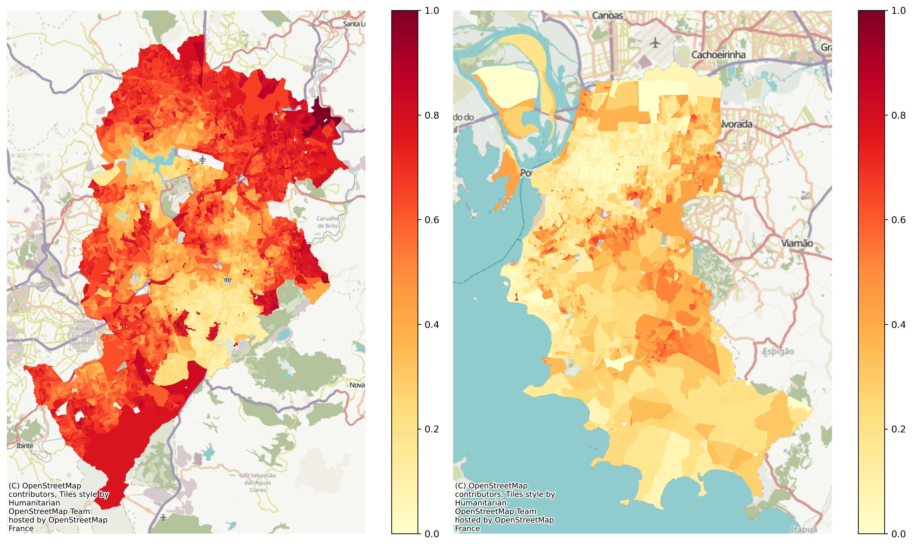

<!--

NEW JOSS REQUIREMENTS

Length

* longer paper acceptable (but not necessarily encouraged...)
*  750-1750

Sections

https://joss.readthedocs.io/en/latest/paper.html#:~:text=Your%20paper%20must-,include,-the%20following%20required

* Summary
* Statement of need
* State of the field
* Software design
* Research impact statement
* AI usage disclosure

-->


# Summary


`segregation` is an open-source Python library for the measurement, analysis, inference, and decomposition of social and spatial segregation patterns. Developed as part of the PySAL ecosystem, the package provides a comprehensive framework for quantifying segregation across a wide range of demographic, socioeconomic, and geographic contexts. It supports both traditional aspatial measures and advanced spatially explicit approaches, enabling researchers to investigate how population groups are distributed across space and how these patterns evolve over time.

Segregation analysis is a central topic in urban studies, geography, sociology, demography, and public policy. The `segregation` package implements a large collection of segregation indices, including single-group, multigroup, local, and spatial measures. These methods capture different dimensions of segregation such as evenness, exposure, concentration, clustering, centralization, and spatial proximity. The package accommodates a variety of spatial representations, including adjacency relationships, distance-based interactions, and network-based structures, allowing users to select measures that align with the theoretical and empirical characteristics of their study area.

Beyond point estimation, `segregation` provides a robust inferential framework for evaluating the statistical significance of segregation measures. Users can perform single-value and comparative hypothesis tests using simulation-based approaches, facilitating rigorous assessments of whether observed segregation patterns differ from those expected under specified null models. The package also includes decomposition methods that separate differences in segregation levels into components attributable to demographic composition and spatial structure, offering deeper insight into the processes underlying segregation dynamics.

Designed to operate natively with Pandas and GeoPandas data structures, `segregation` integrates seamlessly into contemporary Python-based spatial data science libraries and therefore minimizes friction in typical workflows. As a component of the Python Spatial Analysis Library (PySAL) ecosystem [@pysal2007; @rey2022pysalecosystem], it follows shared principles of interoperability, transparency, reproducibility, and methodological rigor. By providing accessible, well-documented, and extensible implementations of state-of-the-art segregation measures, `segregation` serves both applied researchers investigating social inequality and methodological developers advancing quantitative approaches to segregation analysis.


# Statement of need

Residential segregation, inequality, and spatial separation of population groups remain central concerns in urban studies, sociology, demography, geography, and public policy. Researchers and practitioners frequently seek to quantify the extent to which social groups are unevenly distributed across neighborhoods, cities, and regions, as well as to understand how segregation patterns vary across space and time. The increasing availability of demographic and socioeconomic data has expanded opportunities for segregation analysis, but it has also highlighted the need for accessible, transparent, and reproducible computational tools capable of implementing a wide range of segregation measures and inferential procedures.

Traditional software environments for segregation analysis often provide only a limited set of indices, rely on proprietary platforms, or require researchers to implement methods manually. These limitations can hinder reproducibility, reduce methodological transparency, and create barriers for comparing results across studies. Furthermore, advances in segregation research have introduced numerous spatially explicit measures, local indicators, decomposition techniques, and simulation-based inference methods that are not consistently available within existing analytical software.

Within the Python ecosystem, support for segregation analysis was historically fragmented. While libraries such as Pandas and GeoPandas provide essential data structures for handling tabular and spatial data, they do not natively implement segregation measures or associated inferential frameworks. Consequently, researchers often relied on custom scripts, isolated software implementations, or statistical packages in other programming languages, resulting in inconsistent workflows and difficulties in reproducing analyses.

`segregation` addresses these challenges by providing:

* A comprehensive and well-documented API for segregation measurement and analysis
* Native integration with Pandas, GeoPandas, and the broader PySAL ecosystem
* Support for a large collection of aspatial, spatial, local, and multigroup segregation indices
* Functions for measuring and visualizing multiscalar segregation profiles
* Simulation-based inference procedures for evaluating the statistical significance of segregation measures
* Decomposition methods that facilitate the investigation of demographic and spatial sources of segregation
* A strong emphasis on transparency, reproducibility, and methodological extensibility

These capabilities make `segregation` particularly valuable for researchers and practitioners in fields such as urban studies, sociology, demography, geography, public policy, public health, and regional science, where understanding patterns of spatial inequality and social separation is a fundamental analytical objective.

# State of the field

`segregation` is a component of the PySAL ecosystem, which provides a comprehensive suite of tools for spatial analysis in Python. Within this ecosystem, the packages are divided into four types (example libraries in parentheses):

* `Lib`: Core spatial data structures, file IO. Construction and interactive editing of spatial weights matrices & graphs. Alpha shapes, spatial indices, and spatial-topological relationships (`libpysal`)
* `Explore`: Modules to conduct exploratory analysis of spatial and spatio-temporal data (`esda`, `giddy`, `inequality`, etc.)
* `Model`: Estimation of spatial relationships in data with a variety of linear, generalized-linear, generalized-additive, and nonlinear models (`spreg`, `spopt`, `tobler`, `spglm`, etc.)
* `Viz`: Visualize patterns in spatial data to detect clusters, outliers, and hot-spots (`mapclassify`, `splot`, etc.)

`segregation` is present in the **Explore** set of libraries and addresses the specific problem of residential segregation.

Compared to desktop GIS platforms, `segregation` offers several advantages:

* **Reproducibility**: Workflows can be scripted and version-controlled
* **Transparency**: Methods and assumptions are explicit and inspectable
* **Extensibility**: Users can modify or extend algorithms for research purposes
* **Integration**: Segregation analysis can be embedded within larger data science pipelines, including machine learning and statistical modeling

Segregation phenomenon is also possible to be assessed with other softwares like the R packages `OasisR` [@tivadar2019oasisr], `seg` [@segrhong2011] or `segregation` [@Elbers2021]. However, PySAL's `segregation` module distinguishes itself in several critical ways: supports over 40 distinct segregation indices out-of-the-box, it allows simultaneous computation of multiple indices across multi-scalar geographical frameworks with fewer software dependencies, it integrates spatial networks using topological relationships allowing users to measure social separation based on real-world street networks rather than assuming straight-line (Euclidean), it also has a set of function for evaluating statistical significance using simulations, and it also allows users to decompose segregation scores—identifying exactly how much segregation occurs due to spatial context.

In addition, `segregation` provides a native solution for Python users, aligning with the growing adoption of Python in geospatial and data science communities.

# Software design

`segregation` is designed with attention to both flexibility, usability, and inter-operability between its core functions. The library is organized between different sub parts such as `singlegroup`, `multigroup`, `local`, `inference`, `decomposition`, `batch`, `network`, and `dynamics`.[^1] Segregation measures are built using Python classes which can be integrated in subsequent steps, such as inference or decomposition. The module is structured toward two kinds of segregation indices: 'spatially-explicit' and 'spatially-implicit'. The former includes space as part of its original formula. The latter uses the @reardonsullivan2004 approach to state that any segregation index is a spatial index if you transform the data properly.

[^1]: @cortes2020open introduced `segregation` but many new implementations were developed recently and the API suffered a major revision.

Additionally, `segregation` is developed with testing and documentation standards consistent with the Scientific Python ecosystem, ensuring reliability and maintainability.

<!-- "scikit-learn" like API? -->

## Core Functionality

`segregation` organizes its functionality around which type of segregation analysis is interested and each sub-part is explained as follows.


### Single and Multigroup Indices

Single group measures assess segregation between two different groups in a given location (i.e., one group vs. everyone else), Multi group segregation evaluates the simultaneous separation of all groups in a population (e.g., the distribution of White, Black, Asian, and Hispanic residents) across areas. 

Currently, `segregation` has over 40 indices available which represents, from our knowledge, the broader range of indices available for a user in any software. Also, the user can fit many indices at once with a wrapper function in the `batch` module.

### Local Indices

Unlike global indices that summarize an entire metropolitan area into a single value, local indices decompose segregation to the individual geographic unit level. Using these disaggregated measures helps identify precise spatial clusters where social isolation is most acute, uncovering micro-level dynamics that global metrics often mask. Currently, `segregation` has seven local indexes. 

### Multiscalar

The multiscalar profile [@reardon2008geographic] is a tool for measuring spatial segregation dynamics--the way that a segregation index changes values as the concept of a neighborhood changes, and what that tells us about macro versus micro patterns of segregation. The core idea is to calculate a segregation statistic, then expand the spatial scope of a neighborhood, recalculate the statistic, and repeat.

The package has a wrapper named `compute_multiscalar_profile` which can be used in a workflow to build these profiles.

### Simulation based Inference

PySAL's `segregation` module also addresses whether segregation index values are statistically significant under different specifications of a null hyphothesis using Monte Carlo simulations. Currently, for single value inference the module can generate approaches like generate bootstrap replications of the units with replacement (`bootstrap`), multinomial with restricted conditional probabilities (`systematic`), binomial with fixed parameters (`evenness`), geographic unit-level randomization (`geographic_permutation`), among others. For two-value inference, the user can specify resampling to generate distributions of the segregation index for each index (`bootstrap`), generate a synthetic dataset for each region through counterfactual estimates (`composition`), among others.

The correct specification of a null hyphothesis is a crucial part of this framework as different null hypotheses can lead to markedly different inferences, and also different segregation indexes, which can assess different segregation dimensions (i.e. evenness, exposure, concentration, centralization, and clustering) may not be appropriate for some specifications, specially for comparative inference.


### Decomposition

The decomposition approach implemented in the PySAL segregation module provides a framework for comparative segregation analysis that disentangles observed differences in segregation levels into two fundamental components: population composition and spatial structure. Building on the framework proposed by @rey2021comparative, the method uses spatially explicit counterfactual distributions combined with a Shapley value decomposition to determine how much of the difference between two segregation measures (whether across cities, time periods, or spatiotemporal contexts) is attributable to differences in demographic composition versus differences in the spatial arrangement of populations and areal units. 

The method can be applied to a variety of segregation indices and comparison settings, including cross-sectional, temporal, and spatiotemporal analyses. By moving beyond simple comparisons of index values, the decomposition provides a richer interpretation of segregation dynamics and helps identify whether differences arise primarily from changes in population composition or from the spatial organization of neighborhoods. In the module, this functionality is available in the `DecomposeSegregation` class of the `decomposition` sub part.

## Example workflow

Assume you have a dataset (`pandas` or `geopandas` DataFrames) named `data_1`, a typical workflow in `segregation` can be implemented as follows:

```python
from segregation.singlegroup import Dissim

seg_index_1 = Dissim(
    data_1,
    group_pop_var='group_A',
    total_pop_var='total_population'
)
```

This snippet estimates the Dissimilariy index of a specific sub-population (`group with characteristic A`) of your dataframe and can accessed through the `statistic` attribute. If the user is interested in assessing statistical significance of the index, it can simple be implemented as:

```python
from segregation.inference import SingleValueTest

inference_result = SingleValueTest(
    seg_index_1, 
    null_approach='bootstrap'
)
```

This approach assumes the `bootstrap` approach for the generation of the Monte Carlo iterations, and the user can access the pseudo p-value estimated from the simulations through the `p_value` attribute.

To compute all single group indices in one go, the package provides a wrapper function in the `batch` module:

```python
from segregation.batch import batch_compute_singlegroup

all_singlegroup = batch_compute_singlegroup(
    data_1,
    group_pop_var='group_A',
    total_pop_var='total_population'
) 
```

To compute multiscalar profiles of, for example, a Gini index, the user can rely on the `dynamics` module and specify:

```python
from segregation.dynamics import compute_multiscalar_profile

gini_profile =  compute_multiscalar_profile(
    data_1,
    segregation_index=Gini,
    group_pop_var='group_A',
    total_pop_var='total_population',
    distances=range(500,5500,500)
)
```

In terms of comparative segregation indexes, it possible to assess statistical significance between two measures using the `TwoValueTest` of the `inference` module as well as decompose the comparison using `DecomposeSegregation` from `decomposition`. Assume the user would like to compare the segregation of `group_A` between `data_1` and another spatial context `data_2`, therefore, the code


```python
from segregation.inference import TwoValueTest
from segregation.decomposition import DecomposeSegregation

seg_index_2 = Dissim(
    data_2,
    group_pop_var='group_A',
    total_pop_var='total_population'
)

two_value_result = TwoValueTest(
    seg_index_1,
    seg_index_2, 
    null_approach='bootstrap'
)

decomposition_result = DecomposeSegregation(seg_index_1, seg_index_2)
```

\autoref{fig:poa_bh} depicts the black + brown share in total population in each census tract of 2022 in two major Brazilian cities: Belo Horizonte and Porto Alegre. Clear visual synthesis reveals a consistent pattern of socio-spatial segregation, characterized by a "center-periphery" racial gradient in both cities.



\autoref{fig:poa_bh_boot} presents an example of comparative analysis of selected segregation indices via Monte Carlo bootstrap simulations using the PySAL segregation module that reveals significant structural differences in the racial landscapes of Porto Alegre and Belo Horizonte. For global indices such as Dissimilarity (Dissim), Spatial Dissimilarity, and the Gini index, the non-overlapping distributions indicate that Porto Alegre exhibits statistically higher levels of unevenness in population distribution compared to Belo Horizonte. Conversely, the Isolation and Distance Decay Isolation metrics show a dramatic reversal; Belo Horizonte (red) displays significantly higher isolation values (concentrated above 0.60) than Porto Alegre (blue, approximately 0.37), suggesting that despite lower overall dissimilarity, Black and Brown residents in Belo Horizonte are much more likely to live in tracts with high intra-group exposure. Furthermore, the stark divergence in Relative Clustering where Porto Alegre’s distribution is shifted significantly to the right suggests a more intense spatial aggregation of minority groups into contiguous clusters in the southern capital. In contrast, measures like Entropy and Relative Concentration show considerable distributional overlap, indicating that for these specific dimensions of segregation, the differences between the two cities may not reach statistical significance.


# Research impact statement

The package is actively used by the research community to assess segregation in many different contexts. @cortes2020open compared Los Angeles and New-York racial segregation structures. @knaap2024segregated use it to compute the spatial information theory index \(\tilde{H}\) for 380 U.S. metropolitan areas, @rey2024MeasuringSpatial rely on PySAL's `segregation` to measure multigroup dissimilarity in the school‑neighborhood nexus, and @wei2022ReducingRacial employ its dissimilarity index within an optimization model to minimize racial segregation in school districts. The module also underpins comparative segregation analytics [@rey2021comparative] and analyses of historical redlining legacies [@rey2022LegacyRedlining], demonstrating its role as a core computational engine across urban science, education policy, and spatial demography.

In spatial data science education, `segregation` has become part of many curricula. It is included in pedagogical resources including textbooks [@knaapUrbanAnalysis2026], and, also is often taught in global conferences like SciPy.[^2]

[^2]: https://www.youtube.com/watch?v=4AHJVMs7iH4

<!--@rey2021comparative
@cortes2020open
housing policy [@rey2022LegacyRedlining]
@knaap2024segregated
education policy [@rey2024MeasuringSpatial]
@wei2022ReducingRacial


The package is actively used by the research community to transfer the data between various types of geographic boundaries. This is not limited to specific applications but covers use cases from continental analysis of emissions and health [@laporta2024Urban], analysis of urban form and function [@fleischmann2022Geographical], redistribution of census data to school districts for assessment of the Clean School Bus Rebate Program [@osia2025Infrastructure], quantification of radon exposure [@lee2026Quantifyinga], or harmonization of vector and raster data for computer vision tasks [@fleischmann2024Decoding].

Moreover, the package is relied on in downstream software as `atlasbr` for harmonization of Brazilian urban data [@oliveira_paiva_neto_atlasbr], and is referred to in the `pygridmap` package by Eurostat [@grazzini_gaffuri_pygridmap] as a reference implementation.
The `tobler` package has made tangible contributions to spatial science, pedagogy, and applications in government and industry. In academia, the package is used as part of a data-processing pipeline for research that examines the spatial-contextual influence on a variety of outcomes, including segregation [@wei2022ReducingRacial], housing policy [@rey2022LegacyRedlining], education policy [@rey2024MeasuringSpatial; @osia2025InfrastructureEnvironmental], and pollution exposure [@lee2026QuantifyingMean; @laporta2024UrbanScaling]. It is also used in environmental science [@hu2023MethodologicalChallenges] and regionalization research [@feng2022MaxpcompactregionsProblem].

In spatial data science education, `tobler` has become an integral part of many many curricula. It is included in popular pedagogical resources including two textbooks [@reyGeographicDataScience2023; @knaapUrbanAnalysis2026], and is taught in graduate and undergraduate courses in univresities across the globe, including the University of California (Berkeley, Irvine, and Riverside campuses), San Diego State University, Charles University, University of Liverpool, Bristol University, the University of Chicago, Northern Arizona University, and Temple University.

**I took some liberty with a couple of these...we might want to check with Luc and Levi**

In the public sector, the `tobler` package is used as part of a processing pipeline that powers urban planning and policymaking, including two highly visible projects from the Turing Institute, [DemoLand](https://www.turing.ac.uk/research/research-projects/demoland) and [UrbanGrammar](https://www.turing.ac.uk/research/research-projects/urban-grammar). **Martin/Dani could you confirm and add a sentence or two?**?
-->
# AI usage disclosure

No generative AI or LLMs were used for code production for `segregation` or the writing of this paper.

# Acknowledgements

`segregation` is developed as part of the PySAL community, which brings together researchers and developers working on spatial analysis methods and software. The project builds on decades of research in segregation, urban, and spatial data science, and benefits from contributions across the open-source geospatial community.

# References
